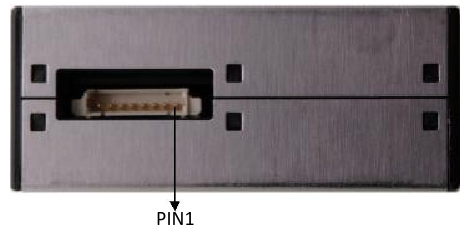
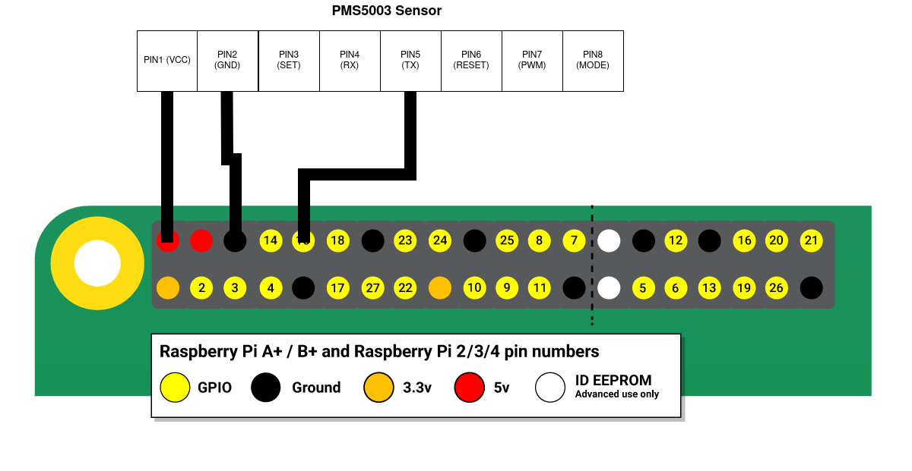

# Air Quality Monitor

This repository provides instructions on how to build a simple air quality
monitor using PMS5003 and Raspberry Pi.

## Prerequisites

* PMS5003 air quality sensor,
* Raspberry Pi 3B+ (or any other board with 5V UART),
* Python3 installed on the board.

## Setup

### Connect PMS5003 sensor to Raspberry Pi

#### PMS5003 Pinout ([source](https://elty.pl/upload/download/PMS5003_LOGOELE.pdf))

| Pin number | Function                                | Explain                                                |
| ---------- | --------------------------------------- | ------------------------------------------------------ |
| PIN1       | VCC                                     | Power supply DC5V                                      |
| PIN2       | GND                                     | Negative power supply                                  |
| PIN3       | SET (Internal 50K pull-up)              | Set pin, 3.3V level                                    |
| PIN4       | RXD / I2C_SCL                           | Digital pin, 3.3V level                                |
| PIN5       | TXD / I2C_SDL                           | Digital pin, 3.3V level                                |
| PIN6       | RESET                                   | Module reset signal, 3.3V level                        |
| PIN7       | PWM                                     | PWM output, 3.3V level (only for single sensor output) |
| PIN8       | Mode selection (Internal 50K pull-up)   | High or NC: Serial port mode (3.3V). Low: I2C mode.    |

#### Raspberry Pi Pinout

As of writing this, all Raspberry Pi boards use the same 40-pin layout ([source](https://www.raspberrypi.com/documentation/computers/raspberry-pi.html#gpio-pads-control)).

#### Connection

In order to connect the sensor to the board, connect the corresponding power (VCC) and ground (GND) pins, then wire the sensor's TX pin to the Raspberry Pi's RX pin. The PMS5003 only transmits data and does not accept serial input.

## Resources

[PMS5003 Data Sheet](https://www.aqmd.gov/docs/default-source/aq-spec/resources-page/plantower-pms5003-manual_v2-3.pdf)

[PMS5003 Data Sheet 2](https://elty.pl/upload/download/PMS5003_LOGOELE.pdf)

[Raspberry Pi Docs](https://www.raspberrypi.com/documentation/computers/raspberry-pi.html#gpio-pads-control)

